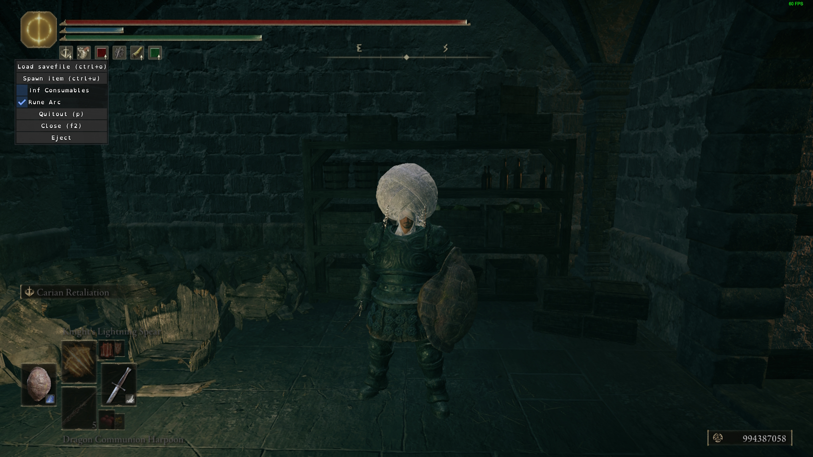

# Elden Ring Invasion Tool

[](https://github.com/chozandrias76/eldenring-pvp-tool/actions)
[](https://github.com/chozandrias76/eldenring-pvp-tool/releases/latest)

A tool for enhancing invasion and invasion build-making.

The tool is free, and will always be free for everyone.


## Getting started

Download the **latest stable release** [here](https://github.com/chozandrias76/eldenring-pvp-tool/releases/latest).

Prerequisites:

- Antiviruses are disabled. This includes Windows Defender. If you don't want to do that, make sure to whitelist the contents of the practice tool in your antivirus.
- You are using a _completely vanilla_ install of the game, _with no mods whatsoever_. If you installed mods already, please reinstall Elden Ring from scratch.
- You are not using other overlay software, such as RivaTuner Statistics Server, FRAPS or similar. The Steam Overlay is an exception.
- You have a legitimate copy of the game. Pirated copies will never be supported.
- EAC is [bypassed](https://soulsspeedruns.com/eldenring/eac-bypass/) with the textfile method.
Other methods aren't supported and could make it impossible to run the tool.

The tool will apply the bypass for you on the first run, so it is recommended not to do it
manually.

## Running the tool

### Standalone

- Extract all files from the zip archive. Anywhere will do.
- Double-click `offline_launcher_put_in_game_folder.bat` or similar to start the game
- Double-click `jdsd_er_practice_tool.exe`.

The tool will show similar to the screenshot(s) when it loads.

### Installed

- Extract all files from the zip archive. Anywhere will do.
- Locate your **ELDEN RING** installation.
- Copy `er_invasion_tool.toml` and `jdsd_er_practice_tool.dll` within the `mods` folder in the folder you
  just found. Create this folder if it doesn't exist.
- Double-click your own DLL injector, such as [Mod Loader](https://github.com/techiew/EldenRingModLoader/releases/tag/Binary), to start the game. **Never** start the game from Steam: the tool won't work.
- During the startup, from now on, hold the right shift button for a few seconds until 
  the tool appears on screen.

If you don't want to load the tool, don't press right shift during startup!

If you want to uninstall the tool, remove `jdsd_er_practice_tool.dll` and `er_invasion_tool.toml`.

## Running the tool on Linux

The tool fully supports Linux and should run on Steam Deck seamlessly. But is not regularly tested.

### Standalone

If you want to run the tool in a standalone fashion, I recommend [protontricks](https://github.com/Matoking/protontricks):

```sh
protontricks-launch --appid 1245620 jdsd_er_practice_tool.exe
```

### Installed

Follow the same instructions as above. Additionally, you have to set the launch options in Steam as follows:

```sh
WINEDLLOVERRIDES="dinput8=n,b" %command%
```

## Help

If the tool doesn't work, you need help, or want to get in touch, read the [troubleshooting guide](TROUBLESHOOTING.md).

If you are looking to submit a patch, check the [contributing guide](CONTRIBUTING.md).

# Credits

- Andrea Venuta [for the original tool](https://github.com/veeenu/eldenring-practice-tool).

